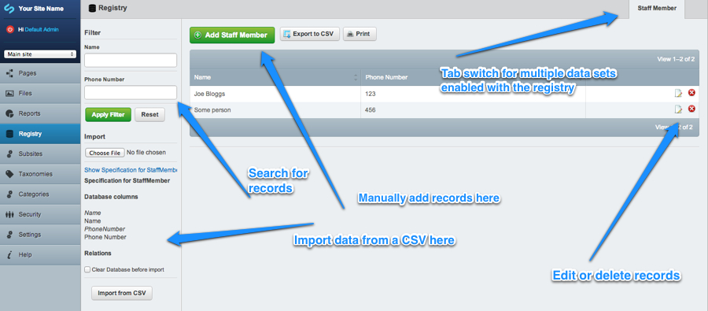

# Registry module

## Introduction

This module allows a website user to search, find details for, and export search results
for a particular type of data.

One example this could be used for is a listing of staff members.

## Instructions

To use the registry module, you need to define the data you wish to store and then set up the pages
to search through the data.

### Defining the data

Each registry is a list of a single type of DataObject. These DataObject definitions must implement
the `RegistryDataInterface` and the `getSearchFields` abstract function.

Here's an example of what a staff member definition might look like:

	:::php
	<?php
	class StaffMember extends DataObject implements RegistryDataInterface {
		public static $db = array(
			'Name' => 'Varchar(255)',
			'PhoneNumber' => 'Varchar(50)'
		);
		
		public function getSearchFields() {
			return new FieldList(
				new TextField('Name'),
				new TextField('PhoneNumber')
			);
		}
	}

Run /dev/build and now the Registry tab will appear in the CMS. From here you can use this tab to manage
your registry data. All DataObject classes that implement `RegistryDataInterface` will appear in here.

### Managing the data

Pictured above is a summary of the admin area for managing registry data.

Multiple tabs will appear if you have multiple classes implementing `RegistryDataInterface`.

#### Importing data

On the left under "Filter" is a panel for uploading a CSV with data for that particular registry. A link
for toggling the specification is provided, so you can match the column headers in your CSV file to the
database columns. "Clear Database before import" will truncate the table for that data before importing
the new one, useful if you have a master CSV copy of staff members, for example, and you don't want it
to create duplicates on each import.

### Viewing the data

Create a new page of the "Registry Page" type. In the Content tab, find the "Data class" drop down
and set it to the DataObject that you just created, in this case "Staff Member".

Save and Publish the page and view it in the front end.

### Changing the search results columns

SilverStripe has a built-in way of defining summary fields on a DataObject. You can do that by defining
the static `$summary_fields` in the DataObject definition. The array is a map of `$db` column name to
a viewable title the user will see. In this example we're adding the phone number to the summary list.

	:::php
	<?php
	class StaffMember extends DataObject implements RegistryDataInterface {
		//...
		public static $summary_fields = array(
			'Name' => 'Name',
			'PhoneNumber' => 'Phone number'
		);
		//...
	}

Now when you view the staff member listing on the `RegistryPage` it will show the two columns we
defined above.

This summary definition will also be used in the Registry tab of the CMS.

### Creating a detailed view of a search result

Sometimes the records listed you'll want a user to click through and see more details.

You can do this by defining the `Link` method on your registry DataObject. For example:

	:::php
	<?php
	class StaffMember extends DataObject implements RegistryDataInterface {
		//...
		public function Link($action = 'show') {
			$page = RegistryPage::get()->filter('DataClass', 'StaffMember')->First();
			return Controller::join_links($page->Link(), $action, $this->ID);
		}
		//...
	}

This method can return a link to any place you wish. The above example will link to
the `show` action on the RegistryPage for StaffMember.

The default template `RegistryPage_show.ss` is very simple and only shows a debug
representation of the data. See "Overriding templates" below on how to change this
template.

### Overriding templates

While the default template does its best to be functional and easy-to-style, it's quite likely that
you'll need to change the templates. You can do so by placing the templates `RegistryPage.ss` and
`RegistryPage_show.ss` in your themes templates/Layout folder. You can base these off the files found
in registry/templates/Layout.

As a further layer of customisation, you can create templates that will be only used when viewing
specific registries. So if you wanted to create a template that would only be used to view the
StaffMember registry, you would create `RegistryPage_StaffMember.ss` and `RegistryPage_StaffMember_show.ss`

